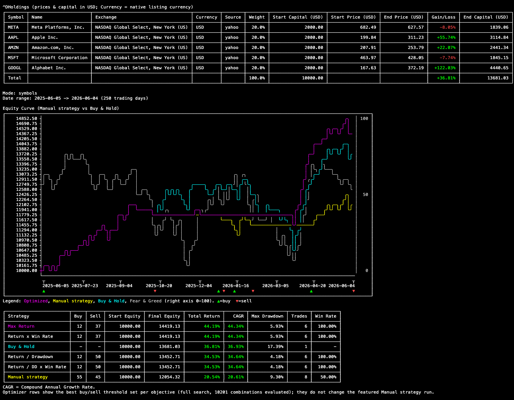

# backtest-feed-and-greed

TypeScript Node.js CLI for backtesting a stock strategy driven by the [CNN Fear & Greed index](https://www.cnn.com/markets/fear-and-greed).

## Example



## Features

- **Symbol mode** (default): one or more tickers via `--symbols AAPL` or comma-separated `--symbols AAPL,MSFT,TSLA`; defaults to `MSFT` when none are given
- **Portfolio mode** (`--portfolio`): backtests all open Trading212 holdings weighted by capital allocation (requires `TRADING212_API_TOKEN`)
- **FX normalization**: all symbol prices are converted into a single base currency (`--base-currency`, default `USD`) using daily FX rates, so multi-currency portfolios are valued in comparable money (including currency movements). Minor units like pence (`GBp`/`GBX`) are handled automatically; symbols whose currency or FX rate can't be resolved are skipped with a warning.
- **Multi-threshold strategy**: buy and sell at multiple Fear & Greed crossing levels (comma-separated, e.g. `--buy-threshold 55,65`)
- **Threshold optimizer** (always on): searches sets of 1–N buy × 1–N sell thresholds (N = `--max-thresholds`, 1 to 3, default 1) for the best under four objectives, with a selectable search strategy (`--optimizer-strategy greedy|coarse|single-expand|full`, default `full`) — multi-threaded across CPU cores (one left free), with a live progress spinner. The best optimized strategy by total return is overlaid on the equity chart in magenta.
- Backtest time range with flexible format (e.g., `365`, `7d`, `52w`, `2m`, `2y`; default: 1 year, calendar-based)
- Selectable price provider: `hybrid` (default, Yahoo → TradingView), `yahoo`, `tradingview`
- ESLint + Prettier + pre-commit hook support
- **Terminal output:**
  - ASCII equity curve (strategy in yellow, buy & hold in cyan, Fear & Greed index in grey)
  - Colored legend below the chart
  - Holdings table with prices and capital shown in the base currency (the `Currency` column reports each symbol's native listing currency)
  - Performance table with **Buy & Hold** (baseline) and **Manual strategy** rows. The optimizer's best thresholds per objective are always appended as extra rows in the same table.
  - CAGR note below the table

## Setup

```bash
npm install
cp .env.example .env
```

Set your credentials in `.env`. Trading212 is required for portfolio mode; TradingView cookies are optional but can increase rate limits:

```bash
TRADING212_API_TOKEN=API_KEY:API_SECRET

# Optional — TradingView session cookies for higher data access
# Get these from browser DevTools → Application → Cookies on tradingview.com
# TRADINGVIEW_SESSION=your-sessionid-cookie
# TRADINGVIEW_SIGNATURE=your-tradingviewui_sign-cookie
```

## API Permissions

This application uses **read-only access** to the Trading212 API. No trade execution or account modification permissions are required.

### Required Permissions

- ✅ View portfolio positions (GET `/api/v0/equity/positions`)

### Generating Your API Token

1. Visit [Trading212 API Docs](https://docs.trading212.com/api)
2. Navigate to the API token section in your account settings
3. Generate an API key and API secret pair (read-only scopes are enough for this app)
4. Paste them into `.env` as `TRADING212_API_TOKEN=API_KEY:API_SECRET`

These credentials are used for Basic authentication and grant read-only access to your portfolio data, making them safe to use in this backtesting flow.

## Install as a global command

To install `btfeargreed` as a globally available CLI command:

```bash
npm install
npm run build
npm install -g .
```

Then run:

```bash
btfeargreed --help
```

**Environment:** `btfeargreed` reads `.env` from your current working directory. Only `TRADING212_API_TOKEN` is required for `--portfolio` mode; symbol mode needs no credentials. Alternatively, export credentials as environment variables instead of using `.env`.

## Usage

Run help (via development):

```bash
npm run dev -- --help
```

Or if installed globally:

```bash
btfeargreed --help
```

Examples (replace `npm run dev --` with `btfeargreed` if using the global install):

```bash
# Default 1-year backtest (MSFT)
npm run dev --

# Single-stock backtest over a custom range with custom thresholds
npm run dev -- --symbols AAPL --time 3y --buy-threshold 60 --sell-threshold 40

# Multiple buy/sell thresholds (trade at each crossing level)
npm run dev -- --buy-threshold 55,65 --sell-threshold 45,35

# Calendar 2-month backtest
npm run dev -- --time 2m

# Force Yahoo-only pricing
npm run dev -- --price-provider yahoo

# Multi-symbol backtest (equal weight)
npm run dev -- --symbols AAPL,MSFT,TSLA --time 2y

# Portfolio backtest (all open Trading212 positions; requires TRADING212_API_TOKEN)
npm run dev -- --portfolio --time 2y

# Value everything in EUR instead of the default USD (FX-normalized)
npm run dev -- --portfolio --base-currency EUR
```

## Threshold Optimization

Every run searches **sets of 1–3 buy thresholds × 1–3 sell thresholds** (including
asymmetric counts, e.g. 1 buy + 3 sell) and reports the best thresholds for four
objectives. Scoring is ratio-based and parameter-free; for combos with a non-positive
total return the raw return is used so the optimizer picks the "least bad" result
rather than a misleading ratio.

Because the full integer 1–3 subset space is enormous (≈ 29.5 billion backtests), the
search method is selectable via `--optimizer-strategy`, and the number of thresholds
per side is capped via `--max-thresholds` (1 to 3, default 1):

| Strategy        | What it does                                                                                                                                                                                      | Approx. cost                  |
| --------------- | ------------------------------------------------------------------------------------------------------------------------------------------------------------------------------------------------- | ----------------------------- |
| `full`          | **Default.** Integer resolution, all 1–cap subsets both sides (at the default cap of 1 this is the exhaustive 10,201-combo single-threshold grid; warned only when run with `--max-thresholds 3`) | 10.2k at cap 1; huge at cap 3 |
| `greedy`        | Best single buy+sell grid (10,201), then greedily add a buy or sell threshold (≤ cap each)                                                                                                        | ~10.2k+                       |
| `single-expand` | Single-grid anchor, then one ordered pass adding more buy, then more sell thresholds (up to the cap)                                                                                              | ~10.2k+                       |
| `coarse`        | Thresholds restricted to steps of 5 (21 levels); brute-force all 1–cap subsets both sides                                                                                                         | ~2.44M                        |

```bash
# Use a coarse exhaustive multi-threshold search, allowing up to 2 thresholds per side
npm run dev -- --symbols AAPL --optimizer-strategy coarse --max-thresholds 2 --time 90d
```

`greedy` and `single-expand` are heuristics anchored on the best single-threshold
combo, so they can never finish worse than the single-threshold winner; `coarse` is the
broad-search alternative. `full` at the default cap of 1 is exhaustive and instant; at
`--max-thresholds 3` it is uncapped and guarded by a verbose warning.

| Objective              | Considers           | Score (positive-return combos)                |
| ---------------------- | ------------------- | --------------------------------------------- |
| Max Return             | return only         | `totalReturn`                                 |
| Return / Drawdown      | low drawdown        | `totalReturn / maxDrawdown`                   |
| Return × Win Rate      | win rate            | `totalReturn × (winRate / 100)`               |
| Return / DD × Win Rate | drawdown + win rate | `(totalReturn / maxDrawdown) × (winRate/100)` |

A zero-drawdown positive-return combo is treated as ideal for the drawdown
objectives. Score ties break deterministically by higher total return, then
lower drawdown, then higher CAGR, then fewer/lexicographically-smaller threshold sets.

Output: the equity chart and performance table feature the **given** (CLI/default)
buy/sell thresholds. The four objective winners are appended as extra rows in that
same performance table (below the Manual strategy row), showing each objective's best
buy/sell threshold sets (comma-joined) and metrics. They are informational and do not
change the featured backtest.

The search runs **multi-threaded** across all CPU cores (via `worker_threads`),
typically several times faster than single-threaded. It works on any platform and
any core count, and automatically falls back to single-threaded execution when only
one core is available or workers are unsupported — results are identical either way.

## Strategy Logic

The strategy is deterministic and runs in this order:

1. **Initial entry (day 1):** the strategy always buys on the first backtest day using the configured symbol weights.
2. **Crossing-based signals (middle of test):**
   - **Buy trigger:** only when Fear & Greed crosses _any_ buy threshold strictly upward (`previous < threshold` and `current > threshold`).
   - **Sell trigger:** only when Fear & Greed crosses _any_ sell threshold strictly downward (`previous > threshold` and `current < threshold`).
   - Touching a threshold value alone (e.g. `== 55`) does **not** trigger a trade.
   - When multiple thresholds are configured, each crossing is evaluated independently.
3. **Final exit (last day):** if still invested, the strategy always sells on the final backtest day.

This means the strategy is guaranteed to have a defined start and end state for every run.

## Price Providers

| Provider      | Option             | Auth Required                                     | Notes                                                                              |
| ------------- | ------------------ | ------------------------------------------------- | ---------------------------------------------------------------------------------- |
| Yahoo Finance | `yahoo`            | None                                              | Free, reliable for US/major exchanges                                              |
| TradingView   | `tradingview`      | None (optional session cookies for higher limits) | Unofficial WebSocket API — may violate TradingView ToS; fragile but broad coverage |
| Hybrid        | `hybrid` (default) | _(all of the above optional)_                     | Tries Yahoo first, TradingView as fallback                                         |

**Hybrid mode** (`--price-provider hybrid`, default) tries providers in this chain per symbol:
`yahoo → tradingview`

A provider is disabled for the entire run if it returns a provider-wide error (e.g. WebSocket init failure, network outage). A one-time warning is logged and the next provider is tried.

In **single-provider mode**, there is no fallback — the run fails fast with a clear error message.

> **⚠️ TradingView disclaimer:** The TradingView provider uses an unofficial WebSocket protocol and may violate TradingView's Terms of Service. Use it at your own risk. It may break at any time if TradingView changes their internal API.

## Notes

- Fear & Greed data is pulled from a historical CSV source derived from CNN index history.
- Price history is pulled from the selected provider (default: hybrid — Yahoo first, TradingView as fallback).
- All single-provider modes are strict — no fallback. Only `hybrid` falls back through the chain.
- **Price cache:** fetched results are cached to `~/.cache/backtest-feed-and-greed/prices/YYYY-MM-DD/` and reused for the remainder of that calendar day. Old cache directories are automatically pruned on each run.
- Output includes a benchmark row: buy-and-hold from day 1 with no further trades.
- `Compound Annual Growth Rate (CAGR)` is annualized return over the backtest period.
